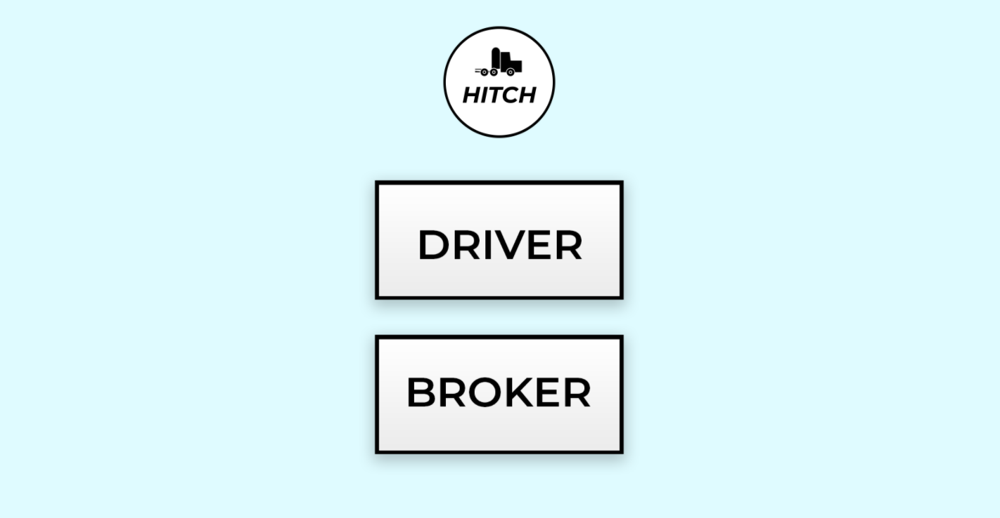
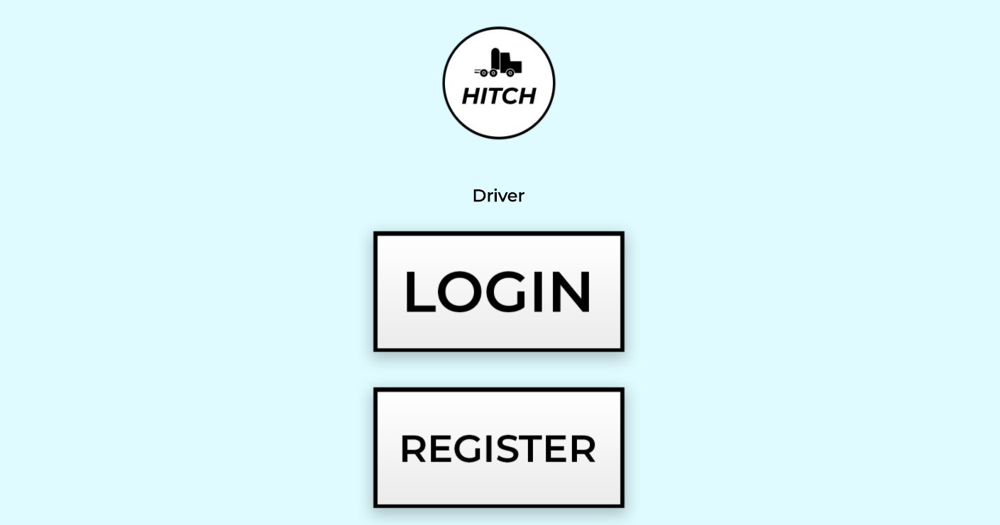
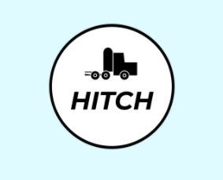

# Welcome to Hitch!

## An app designed for truck drivers and brokers 
### To expedite the delivery process
________________________________________________________

## To install 
1. Open your terminal.
2. Git clone git@github.com:AnansiOmega/BrokerApp.git
3. cd into BrokerApp (case sensitive)
4. Open with code .
5. Run bundle install
6. Run rails s to start the server
________________________________________________________

## Getting started 
**1. In your web browser type http://localhost:3000/ to get to the homepage**

**2. From here you can select from Driver or Broker**
* **Once selected, new users can register, existing users can just login**

**3. After that the navigation is mostly intuitive** 
* **Notice that the Hitch logo is clickable and opperates as an inteligent navigation button**

* **Clicking it will redirect you to the most helpful page**
________________________________________________________
### Creators:
* Ignas Butautas
* Matthew Steele
* Brian Butterly
